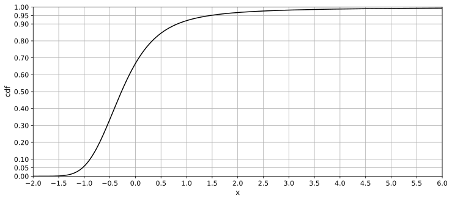
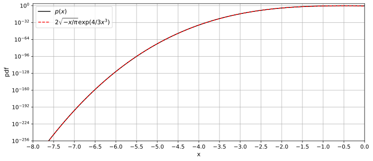

# MapAiryDistribution
 
In probability theory, the Map-Airy distribution (or Airy distribution of the 'Map'-type) describes a brownian excursion over a unit interval.  

This distribution is a special case of a stable distribution with shape parameter &alpha; = 3/2 and skewness parameter &beta; = 1.  
There is also a definition with &beta; = -1, which is inverted in the x-axis direction.  

  
  
  

## Definition
The Map-Airy distribution is as follows:  
  

The scaling factor *c* of the stable distribution is standardize the following:  
  

## Numerical Evaluation
The series expansion of Ai and Ai' with argument *x* squared is as follows:  
  
  

When |*x*| is large, the following equation can be used as an asymptotic expression:  
  
  

Fortunately, when x is large, the exponential function annihilates and integral evaluation becomes easy.  
Otherwise, the coefficients must be evaluated by adding up with the series expansion of the exponential function.  
  

The coefficients of the series expansion are obtained by the recurrence relation as follows:  
  

  

Evaluate these equations collectively:  
*x* near 0:  
  
  
*x* &rarr; &infin;:  
  
*x* &rarr; -&infin;:  
  

Remarkably, the cumulative probability to *x*=0 is exactly 2/3:  
  

## Statistics

|stat|x|note|
|----|----|----|
|mean|0||
|mode|||
|median|-0.2734763098101749523722883574736...||
|variance|N/A|undefined|
|0.01-quantile|-0.1286328156263140898164029409856...||
|0.05-quantile|-0.1034724247045514552350828430407...||
|0.1-quantile |-0.8895329338157856119554196809140...||
|0.25-quantile|-0.6230345400974589058685476106950...||
|0.75-quantile|1.8373125610184220685083687477262...||
|0.9-quantile |8.1875041531854880921677466429954...||
|0.95-quantile|14.592191256427298248407489815973...||
|0.99-quantile|44.468845263338009491209545700074...||

## Property of Tail

The plus *x* side is a fat-tail.  

The minus *x* side poly exponential decays.  

## Numeric Table
[PDF Precision 150](results/pdf_precision150.csv)  
[CDF Precision 150](results/cdf_precision150.csv)  
[Quantile Precision 142](results/quantile_precision142.csv)  

## Reference

## See Also
[LandauDistribution](https://github.com/tk-yoshimura/LandauDistribution)
